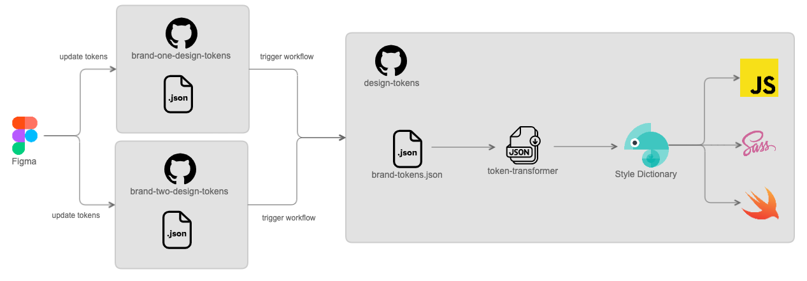

# abacus-design-tokens

A Figma design tokens repository that generates assets for the Paddy Power brand.

## Table of Contents

- [Introduction](#introduction)
- [Technologies](#technologies)
- [How it works?](#how-it-works)
- [How to use it?](#how-to-use-it)
- [Status](#status)
- [Useful links](#useful-links)
- [Credits](#credits)
- [License](#license)

## Introduction

It often happens, having more than one application that implements their specific assets logic (colors, typography, icons, etc) and for some reason, when there's a change on any of these assets, that change needs to be done on every single application that uses them.

Clearly, this is not the ideal process, which would be, not having to change anything on each application, and just let them consume the assets that would be provided by another system. Each application should only be responsible for detecting any change on the assets and trigger that system.

## Technologies

This repository is synched with [Figma](https://www.figma.com/) and uses [GitHub actions](https://docs.github.com/en/actions) to generate the assets every time the [tokens.json](tokens.json) file is updated, meaning that **`Figma` is the source of truth**.

## How it works?

We can look at this repository has being one of the brands repos shown on the previous image, and it's only based on [GitHub actions](https://docs.github.com/en/actions), defined on the [ci.yml](.github/workflows/ci.yml) file. It triggers a workflow every time the [tokens.json](tokens.json) file is pushed, through a [push](https://docs.github.com/en/actions/using-workflows/events-that-trigger-workflows#push) or [pull_request](https://docs.github.com/en/actions/using-workflows/events-that-trigger-workflows#pull_request) event.

It's important to note that this file includes all the design tokens defined and used by the design team on [Figma](https://www.figma.com/), through the [Figma tokens plugin](https://www.figma.com/community/plugin/843461159747178978/Figma-Tokens). They are the ones who have the responsibility to maintain it, so when they decide to change a token, they can push the modified tokens to the branch they're working on. Once this is done, the workflow is triggered.

The first thing being done when the workflow starts, is set some of the following environment variables:

| Variable    | Description                                                                                                                                                                                                                                                                                                                                                                        | Required |         Possible values |           Default value |
| ----------- | :--------------------------------------------------------------------------------------------------------------------------------------------------------------------------------------------------------------------------------------------------------------------------------------------------------------------------------------------------------------------------------- | -------: | ----------------------: | ----------------------: |
| `input`     | JSON Figma tokens file path and name. If you check the [ci.yml](.github/workflows/ci.yml) file, the defined value is `tokens.json` which means, the file is on the root directory.  <u>Example</u>: Lets assume that the file was called `tokens-structure.json` and is was inside a `data` folder located on the root. The value here should be: `data/tokens-structure.json`. |     true |                       - |                       - |
| `output`    | Directory where the assets should be generated.                                                                                                                                                                                                                                                                                                                                    |    false |                       - |             `generated` |
| `platforms` | Platforms to which the assets should be generated (comma separated).                                                                                                                                                                                                                                                                                                               |    false | `scss,css,ios-swift,ts` | `scss,css,ios-swift,ts` |
| `modes`     | Separates the color palettes to dark and light modes (comma separated).                                                                                                                                                                                                                                                                                                            |    false |            `dark,light` |            `dark,light` |
| `sets`      | Sets to be used when transforming the tokens file (comma separated).                                                                                                                                                                                                                                                                                                               |    false |    `base,semantic,comp` |    `base,semantic,comp` |
| `assets`    | List of assets that should be generated (comma separated).                                                                                                                                                                                                                                                                                                                         |    false |    `palette,typography` |    `palette,typography` |

**Note:** For more details on each the these variables, you can take a look at the [design-tokens](https://github.com/Flutter-Global/design-tokens) project.

Then, the following jobs will run by this order, each of them if it's own role:

- `Transform`: Calls the custom GitHub action [Flutter-Global/design-tokens](https://github.com/Flutter-Global/design-tokens), that is responsible for generating the assets depending on the sent input configuration.
- `Commit`: Pushes a new commit to the working branch with the generated assets.
- `Release`: Creates a new tag with the updated branch content. If the working branch is the `main` / `master`, the tag will be ready for production, otherwise will create a prerelease tag with the `beta` suffix.

## How to use it?

[Player Stats](https://github.com/Flutter-Global/sports-stats-hub/pull/4/files) project is already consuming the generated assets using git submodules, so you can take a look at how it's being done.

## Status

Currently, the supported features are:

- `palette` (CSS, Sass, Swift and TypeScript)
- `typography` (CSS, Sass and Swift)

But on a near future, we're planning to support:

- `sizing`
- `spacing`
- `border radius`
- `border width`
- `box shadow`
- `icons`

## Useful links

- [Confluence documentation](https://confluence.app.betfair/display/~mirandal/Cross-platform+Design+System+-+Design+Tokens)
- [Flutter-Global/design-tokens](https://github.com/Flutter-Global/design-tokens)
- [GitHub actions](https://docs.github.com/en/actions)
- [Figma tokens plugin](https://www.figma.com/community/plugin/843461159747178978/Figma-Tokens)
- [Player Stats](https://github.com/Flutter-Global/sports-stats-hub/pull/4/files)

## Credits

Paddy Power / Betfair.

## License

_To be defined._
